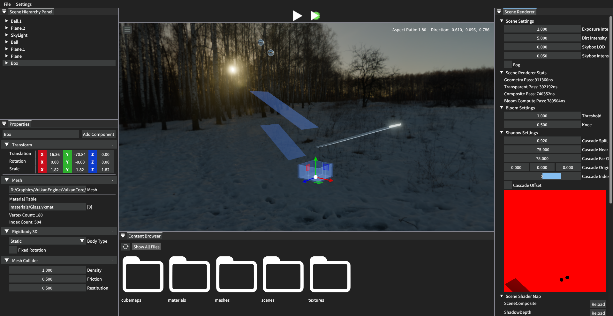
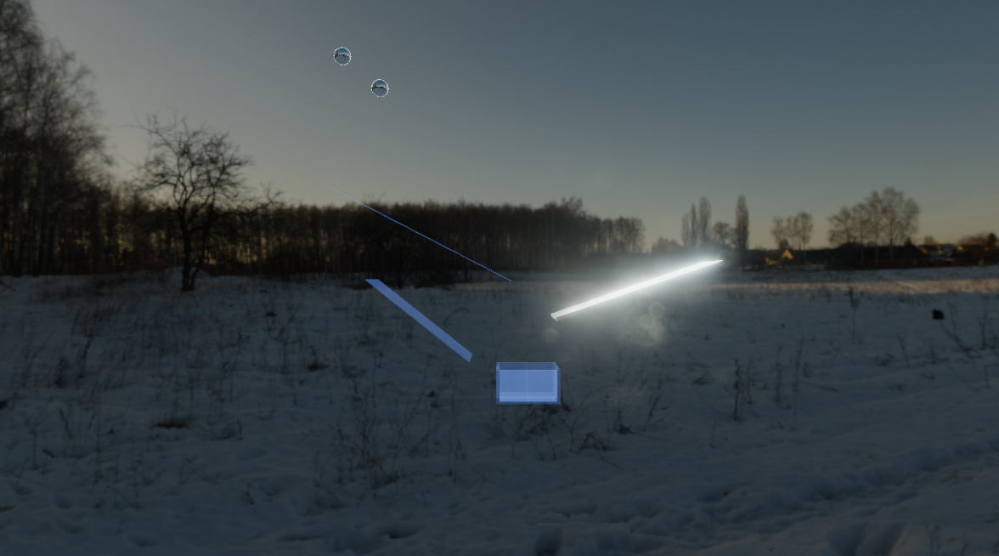

# VulkanEngine

I've created my own little Game/Rendering Engine using Vulkan API.

## Getting Started
**Windows** - Visual Studio 2022 is recommended

**Linux** - CLion IDE is recommended

<ins>1. Downloading the repository</ins>

Start by cloning the repository with `git clone --recursive https://github.com/PrakarshPanwar/VulkanEngine.git`.

<ins>2. Setting up Project</ins>
### Windows
1. Run the [VkGenProjects.bat](VkGenProjects.bat) file found in main repository to generate Project Files.
2. Build Assimp submodule by typing `Y` after this shows up in Command Prompt after Projects Build.
```
BUILD ASSIMP SOLUTION(Y/N)=
```
3. One prerequisite is the Vulkan SDK. If it is not installed, then install [VulkanSDK here](https://vulkan.lunarg.com/).
4. During SDK Setup, check Vulkan Memory Allocator Header and Shader Toolchain Debug, then proceed with installation. 
5. After installation, create a folder **VulkanSDK** in VulkanCore/vendor and copy all the folders of VulkanSDK in [VulkanCore/vendor/VulkanSDK](VulkanCore/vendor).
6. Again run [VkGenProjects.bat](VkGenProjects.bat) to link debug libraries in shaderc.

### Linux
1. Checkout **linux/main** branch.
2. If you are using CLion IDE, it will automatically detect CMake files, right click on root [CMakeLists.txt](CMakeLists.txt) and click **Reload CMake Project**.
3. Install following packages

Fedora/RHEL Distributions
```
sudo dnf install vulkan-loader-devel vulkan-validation-layers vulkan-tools glfw-devel assimp-devel spdlog-devel yaml-cpp-devel libshaderc-devel
```
Ubuntu/Debian Distributions(Not tested)
```
sudo apt-get install libvulkan-dev vulkan-validationlayers vulkan-tools libglfw3-dev libassimp-dev libspdlog-dev libyaml-cpp-dev libshaderc-dev
```
These packages are provided by default on most mainstream distros.

4. Give shell scripts permission to execute
```
chmod +x run_editor.sh run_tracy.sh run_gdb.sh install_vulkan_sdk.sh
```
5. Execute `install_vulkan_sdk.sh` and wait for additional Vulkan dependencies to install.

<ins>3. Building Tracy Profiler</ins>

### Windows
1. Goto [Tracy](VulkanCore/vendor) folder then goto profiler subdirectory.
2. Open the terminal in this directory and make sure you have latest version of CMake installed.
3. Run the following command to build Tracy:
```
cmake -S . -B build
```
4. `-G "Visual Studio 17 2022" -A x64` is optional or just open the `tracy-profiler.sln` file in Visual Studio and build it and skip the next step.
5. Then after building all projects and solution file, type
```
cmake --build build --config Release --target tracy-profiler --parallel
```
This will build the Tracy Profiler Executable. I have also included a Simple Batch Script [TracyLaunchProfiler](TracyLaunchProfiler.bat) to launch the profiler without any hassle. If you don't want tracy profiler just disable `VK_SET_TRACY_PROFILER` in [Core.h](VulkanCore/src/VulkanCore/Core/Core.h)

### Linux
1. Make sure to install these packages

Fedora/RHEL Distributions
```
sudo dnf install patch dbus-devel wayland-devel
```
Ubuntu/Debian Distributions(Not tested)
```
sudo apt-get install patch libdbus-1-dev libwayland-dev
```

2. Type same commands in terminal as given in steps 3 and 5 in Windows version.(**NOTE:** remove `--parallel` from step 5 command if memory shortage issues occur)

## Screenshots
1. Main Editor Layer UI

2. Full Composited Scene


### Features to Add
- Advanced UI Features
- Cascaded Shadow Maps
